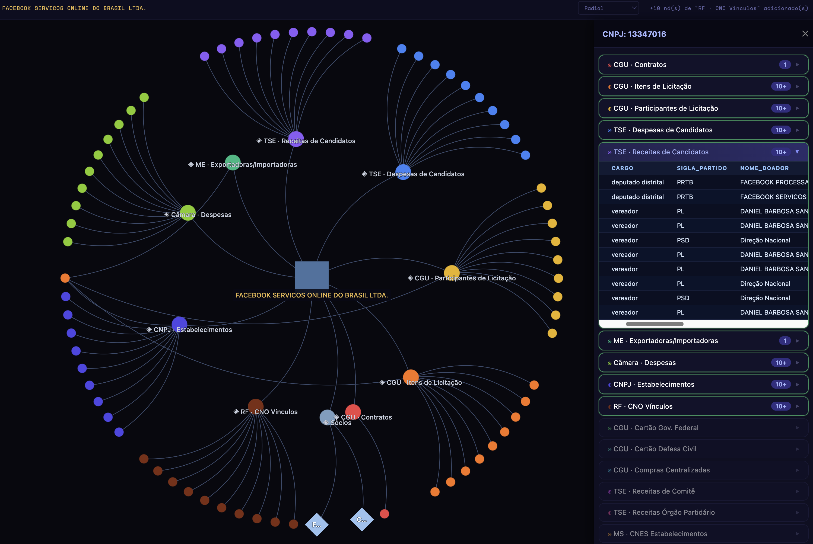

# Datative

O Datative e uma plataforma de analise investigativa focada em conexoes entre empresas, agentes politicos e estruturas de poder, usando dados publicos.

## Foco

- Mapear relacoes societarias, contratos, doacoes e participacoes cruzadas.
- Investigar redes de influencia entre empresas e politicos.
- Transformar dados publicos em evidencias acionaveis para jornalismo, pesquisa e controle social.

## O que investigamos

- Estruturas empresariais complexas e beneficiarios finais.
- Vinculos entre atores politicos, financiadores e fornecedores.
- Padroes de risco em licitacoes, contratos e nomeacoes.
- Evolucao temporal de conexoes relevantes para auditoria civica.

#todo

- [ ] Melhorar o README com exemplos de investigacao.
- [ ] Criar um botao `view labels` para ajustar o tamanho dos nos ao texto completo.
- [ ] Rodar `/smiplify` e remover estado/layout redundante.
- [ ] Remover referencias antigas de `investiga` no frontend e padronizar para `datative`.
- [ ] Adaptar para mobile e rodar `/frontend`.
