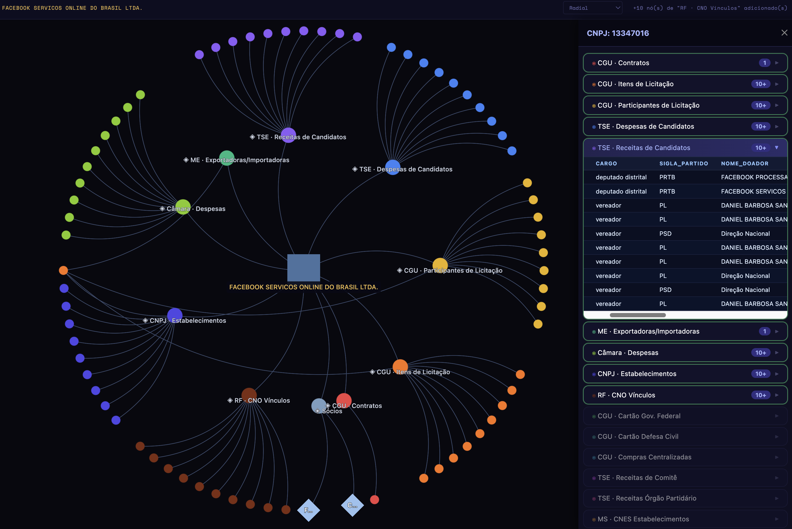

# Datative

  

Datative é um site estático de investigação que mostra as redes das entidades (CNPJ/CPF) com maior abrangência entre datasets publicos federais — Receita Federal, CGU, TSE, SIAFI e mais. Não há consulta ao vivo: todo o grafo de cada entidade é pré-computado offline e servido como JSON estático.

## Principais capacidades

- Landing page lista as 50 empresas e 50 pessoas pré-computadas com maior abrangência (número de datasets distintos em que aparecem, não volume de linhas), em seções separadas.
- Visualização de grafo (empresa/pessoa <-> sócios <-> registros de outros datasets), servida a partir de `static/entities/<id>.json`. Cada dataset com hits vira um nó-hub colorido (ex. "CGU · Contratos") com seus registros pendurados embaixo.
- Painel lateral com uma seção por dataset (tabela de colunas originais, linha a linha) — clicar no nó-hub de um dataset no grafo foca/expande a seção correspondente no painel.
- Layouts de grafo:
  - `radial`
  - `radial-compact` ("Radial Compacto") — mesmo layout, mas limita quantos registros de cada dataset aparecem no anel (o resto vira um nó "+N mais"), para grafos com muitos hits por dataset
  - `forceatlas2`
  - `collapsible-tree`
  - `pack` (circle packing hierarquico, estilo D3 pack)
- Sem servidor de dados em tempo de request — `src/index.ts` só lê arquivos estáticos.

App local:

- Landing/graph: `http://localhost:3003/`

## Scripts

- `bun run start`: sobe o servidor estático (`src/index.ts`)
- `bun run dev`: modo watch
- `bun run build:graph`: rebuild de `public/graph.js` a partir de `src/graph-client.ts`
- `bun run generate:static`: roda `scripts/generate-static-entities.ts` (consulta `beelink` via SSH offline e grava `static/`) — aceita `--top=N` (padrão 50, por tipo), `--per-dataset-limit`, `--concurrency`, `--force`
- `bun run test`: roda os testes (`tests/`)
- `bun run typecheck`: roda o typecheck em TypeScript

API:

- `GET /api/graph/:id` — lê `static/entities/:id.json` diretamente; 404 se a entidade não foi pré-computada.

## Arquitetura

- `src/index.ts`: servidor HTTP puramente estático — landing page (agrupada em Empresas/Pessoas), página de grafo, `/api/graph/:id` lendo `static/`. Também injeta `window.__DATASET_COLORS`/`window.__DATASET_META` (label, cor, campos id/label por dataset) a partir de `cnpj-datasets.ts`, para o cliente montar o painel sem nenhum fetch adicional.
- `src/graph-client.ts` + `src/node-shape-programs.ts`: bundle browser (Sigma 3 + graphology). Agrupa cada dataset com hits sob um nó-hub e monta o painel lateral diretamente do JSON já carregado — não há nenhuma chamada de rede além do `GET /api/graph/:id` inicial.
- `src/cnpj-datasets.ts`: configuração de datasets/cores usada tanto pelo cliente (coloração dos nós, metadados do painel) quanto pelo gerador.
- `scripts/generate-static-entities.ts`: **único** lugar que fala com dados ao vivo. Ranqueia empresas e pessoas **separadamente** por quantidade de datasets distintos em que aparecem (não por volume de linhas — evita que um só dataset gigante domine o ranking), pré-computa a rede de cada uma no mesmo formato `{nodes,links}` (cada nó de dataset carrega a linha SQL original em `row`, usada pelo painel) e grava em `static/entities/<id>.json` + `static/entities-index.json`.
- `scripts/lib/`: camada de acesso a dados usada só pelo gerador (offline) — `duckdb-ssh.ts` (SQL via SSH em `beelink`), `parquet-store.ts` (monta `SELECT`/`WHERE`/`LIMIT` contra as views do catálogo), `cnpj-index.ts` (matching de coluna CNPJ/CPF).
- `data/schemas.json`: catálogo local dataset/tabela → colunas, usado por `scripts/lib/parquet-store.ts`.

## Estrutura de arquivos

- `src/`: servidor + cliente de grafo (ver Arquitetura acima)
- `scripts/`: `generate-static-entities.ts`, `benchmark.ts`, `lib/` (acesso a dados offline)
- `data/`: `schemas.json` (catálogo de tabelas)
- `static/`: saída gerada por `generate-static-entities.ts` (`entities/`, `entities-index.json`) — o que o servidor realmente serve
- `public/graph.js`: bundle browser gerado a partir de `src/graph-client.ts`
- `tests/`: testes unitários (`bun test`)

## Licenca

Defina aqui a licenca oficial do projeto (ex.: MIT, Apache-2.0, proprietaria).
