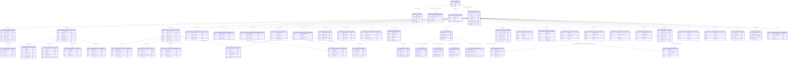

# Basedosdados Entities Diagram

```mermaid
erDiagram

BR_CGU_LICITACAO_CONTRATO_CONTRATO_COMPRA {
  string cpf_cnpj_contratado
  string id_contrato PK
  string id_licitacao
  unknown objeto_contrato
  unknown valor_contrato
  unknown data_assinatura
  string nome_contratado
}

BR_CGU_LICITACAO_CONTRATO_LICITACAO_ITEM {
  string cpf_cnpj_vencedor
  string id_licitacao
  string descricao_item
  float valor_item
  string nome_vencedor
}

BR_CGU_LICITACAO_CONTRATO_LICITACAO_PARTICIPANTE {
  string cpf_cnpj_participante
  string id_licitacao
  string nome_participante
  boolean vencedor
}

BR_CGU_CARTAO_PAGAMENTO_MICRODADOS_GOVERNO_FEDERAL {
  string cnpj_cpf_favorecido PK
  string nome_favorecido
  float valor_transacao
  date data_transacao
  string nome_portador
}

BR_CGU_CARTAO_PAGAMENTO_MICRODADOS_DEFESA_CIVIL {
  string cnpj_cpf_favorecido PK
  string nome_favorecido
  float valor_transacao
  date data_transacao
}

BR_CGU_CARTAO_PAGAMENTO_MICRODADOS_COMPRAS_CENTRALIZADAS {
  string cnpj_cpf_favorecido PK
  string nome_favorecido
  float valor_transacao
  date data_transacao
}

BR_TSE_ELEICOES_DESPESAS_CANDIDATO {
  string cpf_cnpj_fornecedor PK
  string sequencial_candidato
  unknown nome_candidato
  string nome_fornecedor
  float valor_despesa
  string descricao_despesa
  unknown ano_eleicao
}

BR_TSE_ELEICOES_RECEITAS_CANDIDATO {
  string cpf_cnpj_doador PK
  string sequencial_candidato
  unknown nome_candidato
  string nome_doador
  float valor_receita
  string descricao_receita
  unknown ano_eleicao
}

BR_TSE_ELEICOES_RECEITAS_COMITE {
  string cpf_cnpj_doador PK
  unknown nome_partido
  string nome_doador
  float valor_receita
  unknown ano_eleicao
}

BR_TSE_ELEICOES_RECEITAS_ORGAO_PARTIDARIO {
  string cpf_cnpj_doador PK
  string nome_partido
  string nome_doador
  float valor_receita
  unknown ano_eleicao
}

BR_ME_EXPORTADORAS_IMPORTADORAS_ESTABELECIMENTOS {
  string cnpj PK
  string razao_social
  string sigla_uf
  string id_municipio
  string id_exportacao_importacao
}

BR_MS_CNES_ESTABELECIMENTO {
  string cpf_cnpj PK
  string id_estabelecimento_cnes
  string tipo_unidade
  string id_municipio
  string sigla_uf
}

BR_CAMARA_DADOS_ABERTOS_DESPESA {
  string cnpj_cpf_fornecedor PK
  string id_deputado
  string nome_parlamentar
  string fornecedor
  float valor_liquido
  string categoria_despesa
  integer ano_competencia
}

BR_CAMARA_DADOS_ABERTOS_LICITACAO_CONTRATO {
  string cpf_cnpj_fornecedor
  string id_licitacao
  string id_contrato PK
  string descricao
  string nome_fornecedor
  integer valor_original
  date data_assinatura
}

BR_ANATEL_BANDA_LARGA_FIXA_MICRODADOS {
  string cnpj
  string produto
  unknown municipio
  unknown uf
  unknown velocidade_contratada
}

BR_ANP_PRECOS_COMBUSTIVEIS_MICRODADOS {
  string cnpj_revenda
  unknown municipio
  unknown uf
  string produto
  unknown valor_venda
  date data_coleta
}

BR_ANS_BENEFICIARIO_INFORMACAO_CONSOLIDADA {
  string cnpj
  unknown nome_razao_social
  unknown modalidade
  unknown uf
  unknown municipio
}

BR_BCB_ESTBAN_AGENCIA {
  string cnpj_basico
  unknown nome_instituicao
  unknown municipio
  unknown uf
  unknown data_inicio
}

BR_BCB_SICOR_MICRODADOS_OPERACAO {
  string cnpj_basico_instituicao_financeira
  unknown valor_contratado
  unknown produto
  unknown finalidade
  integer ano
}

BR_BD_DIRETORIOS_BRASIL_EMPRESA {
  string cnpj_basico
  unknown nome
  unknown sigla
  string natureza_juridica
}

BR_CGU_PESSOAL_EXECUTIVO_FEDERAL_TERCEIRIZADOS {
  string cnpj_empresa
  unknown nome_empresa
  unknown orgao
  unknown nome_terceirizado
  unknown cargo
}

BR_CVM_ADMINISTRADORES_CARTEIRA_PESSOA_JURIDICA {
  string cnpj
  unknown nome_razao_social
  unknown tipo
  string situacao
  date data_registro
}

BR_CVM_OFERTA_PUBLICA_DISTRIBUICAO_DIA {
  string cnpj_emissor
  string nome_emissor
  string tipo_ativo
  string valor_total
  unknown data
}

BR_INEP_CENSO_ESCOLAR_ESCOLA {
  string cnpj_escola_privada
  string id_escola
  unknown nome_escola
  unknown municipio
  unknown uf
  unknown tipo_escola
}

BR_TRASE_SUPPLY_CHAIN_SOY_BEANS_CRUSHING_FACILITIES {
  string cnpj
  unknown nome
  unknown municipio
  unknown uf
  unknown capacidade
}

BR_TRASE_SUPPLY_CHAIN_SOY_BEANS_STORAGE_FACILITIES {
  string cnpj_cpf
  unknown nome
  unknown municipio
  unknown uf
  unknown capacidade
}

BR_SP_ALESP_DESPESAS_GABINETE {
  string cpf_cnpj PK
  string fornecedor
  float valor
  string tipo
  string nome_deputado
}

BR_MS_SIH_AIHS_REDUZIDAS {
  string cnpj_estabelecimento
  string id_estabelecimento_cnes
  string id_municipio_estabelecimento
  integer sigla_uf
  string carater_internacao
}

BR_SGP_INFORMACAO_DESPESAS_CARTAO_CORPORATIVO {
  string cpf_cnpj_fornecedor PK
  string nome_fornecedor
  float valor
  unknown descricao
}

BR_ME_CNPJ_ESTABELECIMENTOS {
  string cnpj_basico
  string cnpj PK
  string nome_fantasia
  string sigla_uf
  string id_municipio
  string cnae_fiscal_principal
  string situacao_cadastral
  integer ano
}

BR_CGU_LICITACAO_CONTRATO_LICITACAO {
  string id_licitacao PK
  string objeto
  string modalidade_compra
  string situacao_licitacao
  float valor_licitacao
  string sigla_uf
}

BR_CGU_LICITACAO_CONTRATO_LICITACAO_EMPENHO {
  string id_licitacao
  string id_empenho PK
  string nome_unidade_gestora
  string modalidade
  string observacao
}

BR_CGU_LICITACAO_CONTRATO_CONTRATO_ITEM {
  string id_contrato
  string id_item PK
  string descricao_item
  string descricao_complementar_item
  string nome_orgao
}

BR_CGU_LICITACAO_CONTRATO_CONTRATO_TERMO_ADITIVO {
  string id_contrato
  string id_termo_aditivo PK
  string nome_orgao
  string nome_ug
  date data_publicacao_dou
}

BR_CGU_LICITACAO_CONTRATO_CONTRATO_APOSTILAMENTO {
  string id_contrato
  string id_apostilamento PK
  string descricao_apostilamento
  string nome_orgao
  date data_apostilamento
}

BR_TSE_ELEICOES_BENS_CANDIDATO {
  string id_eleicao
  string sequencial_candidato
  string tipo_item
  string descricao_item
  float valor_item
}

BR_TSE_ELEICOES_RESULTADOS_CANDIDATO {
  string id_eleicao
  string sequencial_candidato
  string numero_candidato
  string resultado
  integer votos
}

BR_CAMARA_DADOS_ABERTOS_LICITACAO {
  string id_licitacao PK
  string objeto
  string modalidade
  string situacao
  integer valor_estimado
  integer valor_contratado
  date data_abertura
}

BR_CAMARA_DADOS_ABERTOS_LICITACAO_ITEM {
  string id_licitacao
  string id_item PK
  string descricao
  string unidade
  integer quantidade_licitada
  integer valor_unitario_estimado
}

BR_CAMARA_DADOS_ABERTOS_LICITACAO_PEDIDO {
  string id_licitacao
  string id_pedido PK
  string orgao
  string descricao
  date data_cadastro
}

BR_CAMARA_DADOS_ABERTOS_LICITACAO_PROPOSTA {
  string id_licitacao
  string id_proposta PK
  string cpf_cnpj_fornecedor
  integer valor_proposta
  string marca_proposta
}

BR_CAMARA_DADOS_ABERTOS_DEPUTADO {
  string id_deputado PK
  string nome
  string nome_civil
  string sexo
  string sigla_uf_nascimento
}

BR_MS_CNES_PROFISSIONAL {
  string id_estabelecimento_cnes
  string nome
  string tipo_conselho
  string id_registro_conselho
  string cbo_2002
}

BR_MS_CNES_EQUIPE {
  string id_estabelecimento_cnes
  string id_equipe PK
  string tipo_equipe
  string equipe
  string descricao_segmento
}

BR_MS_CNES_LEITO {
  string id_estabelecimento_cnes
  string tipo_especialidade_leito
  string tipo_leito
  integer quantidade_total
  integer quantidade_sus
}

BR_MS_CNES_SERVICO_ESPECIALIZADO {
  string id_estabelecimento_cnes
  string tipo_servico_especializado
  string subtipo_servico_especializado
  string tipo_caracterizacao
  integer quantidade_nacional_estabelecimento_saude_terceiro
}

BR_INEP_CENSO_ESCOLAR_TURMA {
  string id_escola
  string id_turma PK
  string etapa_ensino
  string tipo_turma
  integer quantidade_matriculas
}

BR_INEP_CENSO_ESCOLAR_DOCENTE {
  string id_escola
  string id_docente PK
  string id_turma
  string sexo
  string tipo_contratacao
}

BR_ME_CNPJ_EMPRESAS {
  string cnpj_basico
  unknown cnpj
  integer ano
}

BR_CAMARA_DADOS_ABERTOS_DESPESA ||--o{ BR_CAMARA_DADOS_ABERTOS_DEPUTADO : "id_deputado=id_deputado"
BR_CAMARA_DADOS_ABERTOS_LICITACAO_CONTRATO ||--o{ BR_CAMARA_DADOS_ABERTOS_LICITACAO : "id_licitacao=id_licitacao"
BR_CAMARA_DADOS_ABERTOS_LICITACAO_CONTRATO ||--o{ BR_CAMARA_DADOS_ABERTOS_LICITACAO_ITEM : "id_licitacao=id_licitacao"
BR_CAMARA_DADOS_ABERTOS_LICITACAO_CONTRATO ||--o{ BR_CAMARA_DADOS_ABERTOS_LICITACAO_PEDIDO : "id_licitacao=id_licitacao"
BR_CAMARA_DADOS_ABERTOS_LICITACAO_CONTRATO ||--o{ BR_CAMARA_DADOS_ABERTOS_LICITACAO_PROPOSTA : "id_licitacao=id_licitacao"
BR_CGU_LICITACAO_CONTRATO_CONTRATO_COMPRA ||--o{ BR_CGU_LICITACAO_CONTRATO_CONTRATO_APOSTILAMENTO : "id_contrato=id_contrato"
BR_CGU_LICITACAO_CONTRATO_CONTRATO_COMPRA ||--o{ BR_CGU_LICITACAO_CONTRATO_CONTRATO_ITEM : "id_contrato=id_contrato"
BR_CGU_LICITACAO_CONTRATO_CONTRATO_COMPRA ||--o{ BR_CGU_LICITACAO_CONTRATO_CONTRATO_TERMO_ADITIVO : "id_contrato=id_contrato"
BR_CGU_LICITACAO_CONTRATO_CONTRATO_COMPRA ||--o{ BR_CGU_LICITACAO_CONTRATO_LICITACAO : "id_licitacao=id_licitacao"
BR_CGU_LICITACAO_CONTRATO_CONTRATO_COMPRA ||--o{ BR_CGU_LICITACAO_CONTRATO_LICITACAO_EMPENHO : "id_licitacao=id_licitacao"
BR_CGU_LICITACAO_CONTRATO_LICITACAO_ITEM ||--o{ BR_CGU_LICITACAO_CONTRATO_LICITACAO : "id_licitacao=id_licitacao"
BR_CGU_LICITACAO_CONTRATO_LICITACAO_ITEM ||--o{ BR_CGU_LICITACAO_CONTRATO_LICITACAO_EMPENHO : "id_licitacao=id_licitacao"
BR_CGU_LICITACAO_CONTRATO_LICITACAO_PARTICIPANTE ||--o{ BR_CGU_LICITACAO_CONTRATO_LICITACAO : "id_licitacao=id_licitacao"
BR_CGU_LICITACAO_CONTRATO_LICITACAO_PARTICIPANTE ||--o{ BR_CGU_LICITACAO_CONTRATO_LICITACAO_EMPENHO : "id_licitacao=id_licitacao"
BR_INEP_CENSO_ESCOLAR_ESCOLA ||--o{ BR_INEP_CENSO_ESCOLAR_DOCENTE : "id_escola=id_escola"
BR_INEP_CENSO_ESCOLAR_ESCOLA ||--o{ BR_INEP_CENSO_ESCOLAR_TURMA : "id_escola=id_escola"
BR_ME_CNPJ_EMPRESAS ||--o{ BR_BCB_ESTBAN_AGENCIA : "cnpj_basico=@cnpj_basico"
BR_ME_CNPJ_EMPRESAS ||--o{ BR_BCB_SICOR_MICRODADOS_OPERACAO : "cnpj_basico_instituicao_financeira=@cnpj_basico"
BR_ME_CNPJ_EMPRESAS ||--o{ BR_BD_DIRETORIOS_BRASIL_EMPRESA : "cnpj_basico=@cnpj_basico"
BR_ME_CNPJ_EMPRESAS ||--o{ BR_ME_CNPJ_ESTABELECIMENTOS : "cnpj_basico"
BR_ME_CNPJ_EMPRESAS ||--o{ BR_ME_CNPJ_ESTABELECIMENTOS : "cnpj_basico=@cnpj_basico"
BR_ME_CNPJ_ESTABELECIMENTOS ||--o{ BR_ANATEL_BANDA_LARGA_FIXA_MICRODADOS : "cnpj~cnpj"
BR_ME_CNPJ_ESTABELECIMENTOS ||--o{ BR_ANP_PRECOS_COMBUSTIVEIS_MICRODADOS : "cnpj_revenda~cnpj"
BR_ME_CNPJ_ESTABELECIMENTOS ||--o{ BR_ANS_BENEFICIARIO_INFORMACAO_CONSOLIDADA : "cnpj~cnpj"
BR_ME_CNPJ_ESTABELECIMENTOS ||--o{ BR_CAMARA_DADOS_ABERTOS_DESPESA : "cnpj_cpf_fornecedor~cnpj"
BR_ME_CNPJ_ESTABELECIMENTOS ||--o{ BR_CAMARA_DADOS_ABERTOS_LICITACAO_CONTRATO : "cpf_cnpj_fornecedor~cnpj"
BR_ME_CNPJ_ESTABELECIMENTOS ||--o{ BR_CGU_CARTAO_PAGAMENTO_MICRODADOS_COMPRAS_CENTRALIZADAS : "cnpj_cpf_favorecido~cnpj"
BR_ME_CNPJ_ESTABELECIMENTOS ||--o{ BR_CGU_CARTAO_PAGAMENTO_MICRODADOS_DEFESA_CIVIL : "cnpj_cpf_favorecido~cnpj"
BR_ME_CNPJ_ESTABELECIMENTOS ||--o{ BR_CGU_CARTAO_PAGAMENTO_MICRODADOS_GOVERNO_FEDERAL : "cnpj_cpf_favorecido~cnpj"
BR_ME_CNPJ_ESTABELECIMENTOS ||--o{ BR_CGU_LICITACAO_CONTRATO_CONTRATO_COMPRA : "cpf_cnpj_contratado~cnpj"
BR_ME_CNPJ_ESTABELECIMENTOS ||--o{ BR_CGU_LICITACAO_CONTRATO_LICITACAO_ITEM : "cpf_cnpj_vencedor~cnpj"
BR_ME_CNPJ_ESTABELECIMENTOS ||--o{ BR_CGU_LICITACAO_CONTRATO_LICITACAO_PARTICIPANTE : "cpf_cnpj_participante~cnpj"
BR_ME_CNPJ_ESTABELECIMENTOS ||--o{ BR_CGU_PESSOAL_EXECUTIVO_FEDERAL_TERCEIRIZADOS : "cnpj_empresa~cnpj"
BR_ME_CNPJ_ESTABELECIMENTOS ||--o{ BR_CVM_ADMINISTRADORES_CARTEIRA_PESSOA_JURIDICA : "cnpj~cnpj"
BR_ME_CNPJ_ESTABELECIMENTOS ||--o{ BR_CVM_OFERTA_PUBLICA_DISTRIBUICAO_DIA : "cnpj_emissor~cnpj"
BR_ME_CNPJ_ESTABELECIMENTOS ||--o{ BR_INEP_CENSO_ESCOLAR_ESCOLA : "cnpj_escola_privada~cnpj"
BR_ME_CNPJ_ESTABELECIMENTOS ||--o{ BR_ME_EXPORTADORAS_IMPORTADORAS_ESTABELECIMENTOS : "cnpj~cnpj"
BR_ME_CNPJ_ESTABELECIMENTOS ||--o{ BR_MS_CNES_ESTABELECIMENTO : "cpf_cnpj~cnpj"
BR_ME_CNPJ_ESTABELECIMENTOS ||--o{ BR_MS_SIH_AIHS_REDUZIDAS : "cnpj_estabelecimento~cnpj"
BR_ME_CNPJ_ESTABELECIMENTOS ||--o{ BR_SGP_INFORMACAO_DESPESAS_CARTAO_CORPORATIVO : "cpf_cnpj_fornecedor~cnpj"
BR_ME_CNPJ_ESTABELECIMENTOS ||--o{ BR_SP_ALESP_DESPESAS_GABINETE : "cpf_cnpj~cnpj"
BR_ME_CNPJ_ESTABELECIMENTOS ||--o{ BR_TRASE_SUPPLY_CHAIN_SOY_BEANS_CRUSHING_FACILITIES : "cnpj~cnpj"
BR_ME_CNPJ_ESTABELECIMENTOS ||--o{ BR_TRASE_SUPPLY_CHAIN_SOY_BEANS_STORAGE_FACILITIES : "cnpj_cpf~cnpj"
BR_ME_CNPJ_ESTABELECIMENTOS ||--o{ BR_TSE_ELEICOES_DESPESAS_CANDIDATO : "cpf_cnpj_fornecedor~cnpj"
BR_ME_CNPJ_ESTABELECIMENTOS ||--o{ BR_TSE_ELEICOES_RECEITAS_CANDIDATO : "cpf_cnpj_doador~cnpj"
BR_ME_CNPJ_ESTABELECIMENTOS ||--o{ BR_TSE_ELEICOES_RECEITAS_COMITE : "cpf_cnpj_doador~cnpj"
BR_ME_CNPJ_ESTABELECIMENTOS ||--o{ BR_TSE_ELEICOES_RECEITAS_ORGAO_PARTIDARIO : "cpf_cnpj_doador~cnpj"
BR_MS_CNES_ESTABELECIMENTO ||--o{ BR_MS_CNES_EQUIPE : "id_estabelecimento_cnes=id_estabelecimento_cnes"
BR_MS_CNES_ESTABELECIMENTO ||--o{ BR_MS_CNES_LEITO : "id_estabelecimento_cnes=id_estabelecimento_cnes"
BR_MS_CNES_ESTABELECIMENTO ||--o{ BR_MS_CNES_PROFISSIONAL : "id_estabelecimento_cnes=id_estabelecimento_cnes"
BR_MS_CNES_ESTABELECIMENTO ||--o{ BR_MS_CNES_SERVICO_ESPECIALIZADO : "id_estabelecimento_cnes=id_estabelecimento_cnes"
BR_TSE_ELEICOES_DESPESAS_CANDIDATO ||--o{ BR_TSE_ELEICOES_BENS_CANDIDATO : "sequencial_candidato=sequencial_candidato"
BR_TSE_ELEICOES_DESPESAS_CANDIDATO ||--o{ BR_TSE_ELEICOES_RESULTADOS_CANDIDATO : "sequencial_candidato=sequencial_candidato"
BR_TSE_ELEICOES_RECEITAS_CANDIDATO ||--o{ BR_TSE_ELEICOES_BENS_CANDIDATO : "sequencial_candidato=sequencial_candidato"
BR_TSE_ELEICOES_RECEITAS_CANDIDATO ||--o{ BR_TSE_ELEICOES_RESULTADOS_CANDIDATO : "sequencial_candidato=sequencial_candidato"
```
